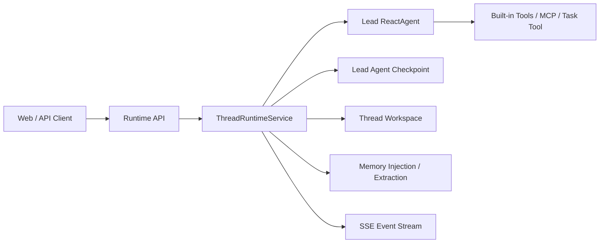

# mai

## Background

`mai` 是一个基于 Spring AI Alibaba 的 Java DeerFlow backend 实现。

这个项目的目标不是机械地 1:1 复刻 DeerFlow Python backend，而是用 Java 生态构建一套更容易维护的长期任务型 Agent Backend，尽量保留 DeerFlow 的核心产品体验：

- 长时间运行、多步骤任务
- 以 `threadId` 为边界的状态持久化与恢复
- 线程级 `workspace / uploads / outputs` 文件隔离
- built-in tools、MCP、skills、memory、artifacts、subtasks
- runtime API 与 platform/admin API 的统一后端

## Architecture

当前仓库采用模块化单体思路：

- `Spring Boot + WebFlux` 作为统一 API 和 SSE 承载层
- `ReactAgent` 作为 lead agent 主执行链路
- lead agent checkpoint 作为线程运行态的唯一真相源
- 线程级 workspace 负责文件隔离与产物落盘
- runtime config / MCP / skills / memory / subtasks 作为平台能力模块接入

### Core Flow

### Current Runtime Shape

- 主链路已经收敛为 `ThreadRuntimeService -> Lead Agent`，不再依赖额外的 outer runtime graph 包装层
- `GET /api/threads/{threadId}` 当前从 lead agent state 投影线程展示态
- `POST /api/threads/{threadId}/runs` 在同步模式下返回 `ThreadStateSnapshot`
- `POST /api/threads/{threadId}/runs` 在 `Accept: text/event-stream` 下返回 run 级真实流式事件
- run 级事件当前已覆盖 `run.started`、`token.delta`、`tool.call.started`、`tool.call.completed`、`run.completed`、`run.failed`

## Docs

- [DeerFlow backend 与 Spring AI Alibaba 能力分析](docs/java-deerflow/01-analysis.md)
- [Java DeerFlow Backend 需求文档](docs/java-deerflow/02-requirements.md)
- [Java DeerFlow Backend 架构设计](docs/java-deerflow/03-architecture.md)
- [Java DeerFlow Backend 开发计划（Codex 任务列表版）](docs/java-deerflow/04-development-plan.md)
- [Java DeerFlow Backend P0 运行时契约](docs/java-deerflow/05-runtime-contract.md)

## Run

- `chmod +x mvnw`
- `./mvnw spring-boot:run`
- health check: `http://localhost:8080/actuator/health`
- create thread: `POST /api/threads`
- get thread: `GET /api/threads/{threadId}`
- run thread: `POST /api/threads/{threadId}/runs`，默认返回 `ThreadStateSnapshot`；当请求 `Accept: text/event-stream` 时会直接返回该次 run 的 SSE 事件流。当前 SSE 已改为直接消费 lead agent 的真实流式输出，不再在 `run.completed` 后补发伪造的 `token.delta`
- run thread request body: 支持可选 `userId`，以及最小可用的 run 级参数：`model_name`、`is_plan_mode`、`subagent_enabled`、`max_concurrent_subagents`
- SSE event stream: 当前会按实际执行过程返回 `run.started`、`token.delta`、`tool.call.started`、`tool.call.completed`、`run.completed`、`run.failed`
- SSE note: run 级流式依赖底层 `ChatModel.stream(...)`；如果 provider 不支持流式，会快速失败而不是静默退回假流式
- delete thread: `DELETE /api/threads/{threadId}`
- list models: `GET /api/models`
- upload files: `POST /api/threads/{threadId}/uploads`
- list uploads: `GET /api/threads/{threadId}/uploads/list`
- delete upload: `DELETE /api/threads/{threadId}/uploads/{filename}`
- list artifacts: `GET /api/threads/{threadId}/artifacts/list`
- read artifact: `GET /api/threads/{threadId}/artifacts/{artifactPath}`
- stream events: `GET /api/threads/{threadId}/events`
- submit approval: `POST /api/threads/{threadId}/approvals/{approvalId}`
- resume thread: `POST /api/threads/{threadId}/resume`
- tests: `./mvnw test`

## Runtime Persistence

- lead agent 会话 checkpoint 默认落在 `data/checkpoints/lead-agent/`
- `GET /api/threads/{threadId}` 当前直接基于 lead agent state 投影线程展示态
- `GET /api/threads/{threadId}` 当前只返回轻量 `messages(role/content)` 视图；工具调用细节应通过 run 级 SSE 事件观察
- 审批恢复所需的 pending approval 与线程 `userId` 绑定当前也保存在 lead agent checkpoint 中
- runtime MCP tools 当前支持 `stdio`、HTTP SSE 与 streamable HTTP 三类 transport，并继续复用 deferred tools / `tool_search` 主链路
- 长期记忆当前已升级为 `facts + structured profile` 共存的文件存储，并通过 debounce 队列异步更新

## Current Boundaries

- 当前 runtime 已具备真流式 SSE 链路，但多 `Generation` 归一化尚未接入 `runtimeChatModel`
- 如果某个 provider 在单轮或单个流式 chunk 中返回多个候选 generation，底层 agent 仍可能只消费其中一条
