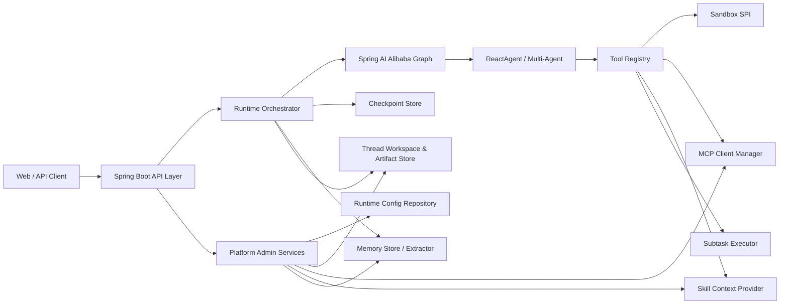
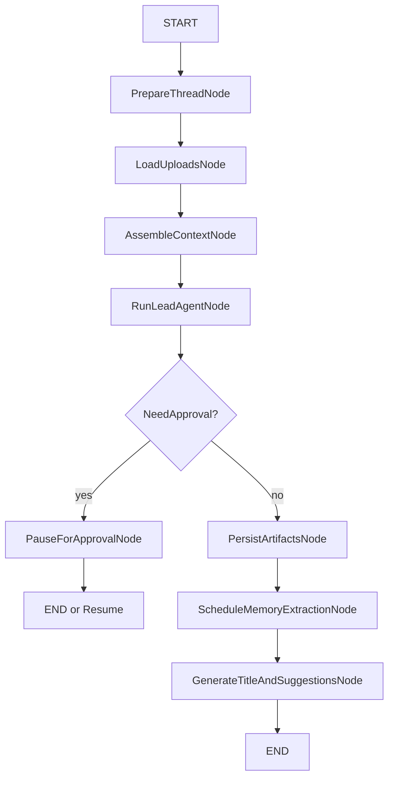

# Java DeerFlow Backend 架构设计

## 1. 设计目标

本架构用于支撑“长期工作任务型 Agent Backend”，重点解决以下问题：

- 如何让 Agent 持续运行、可中断、可恢复。
- 如何让每个线程拥有独立的工作文件环境。
- 如何在 Java 生态里承接 DeerFlow 的 Skills、MCP、Memory、Artifacts、Subtasks 能力。
- 如何把 Spring AI Alibaba 的运行时能力与平台 API 组合成一套完整 backend。

## 2. 总体设计原则

- 运行时与平台能力分层，但首期采用单体部署，降低复杂度。
- Graph 负责工作流，ReactAgent 负责推理循环。
- 所有长任务都以 `threadId` 为恢复边界。
- 文件、工具、记忆、审批、子任务都要纳入统一状态机。
- 对前端暴露稳定 API，对内部保留可替换实现。

## 3. 推荐部署形态

首期建议采用“模块化单体”：

- 一个 Spring Boot 应用。
- 对外同时提供 Runtime API 和 Gateway/Admin API。
- 内部拆为若干逻辑模块。

这样比 DeerFlow 的双进程结构更适合 Java 项目启动阶段，因为：

- 避免 Runtime 与 Gateway 的跨服务状态同步。
- 删除线程时，checkpoint、workspace、artifacts 可在一个事务边界内协调。
- 鉴权、审计、配置、日志和指标只需维护一套。

后续如果压力增大，再拆为：

- `runtime-service`
- `platform-service`
- `sandbox-service`
- `memory-worker`

## 4. 逻辑架构



## 5. 模块划分

以下是逻辑模块，不强制要求一开始就拆成 Maven 多模块。

### 5.1 API Layer

职责：

- 提供线程、运行、上传、产物、模型、MCP、技能、审批等 REST/SSE 接口。
- 对外屏蔽内部 Graph/Agent 细节。

建议子模块：

- `runtime-api`
- `platform-api`

### 5.2 Runtime Orchestrator

职责：

- 创建/恢复 `threadId` 对应的运行上下文。
- 组装 Graph、ReactAgent、Hook、Interceptor、Tool Registry。
- 统一处理运行状态、审批中断、子任务、后处理。

### 5.3 Agent Runtime

职责：

- 承担 lead agent 的 ReAct 循环。
- 调用 built-in tools、MCP tools、subagent tool。
- 通过 Hook/Interceptor 注入规划、压缩、审批、上下文裁剪。

### 5.4 Thread Workspace Service

职责：

- 管理线程目录创建、清理、虚拟路径映射。
- 暴露 `workspace/uploads/outputs` 位置。
- 为 Sandbox 与 ArtifactService 提供统一路径解析。

### 5.5 Sandbox SPI

职责：

- 屏蔽本地进程执行与容器执行差异。
- 提供命令执行、目录查询、文件读写、替换等能力。
- 统一审计命令、超时、资源限制和路径校验。

建议实现：

- `LocalProcessSandboxProvider`：开发环境。
- `ContainerSandboxProvider`：生产环境。

### 5.6 Skill Module

职责：

- 发现技能、读取技能元数据、控制启用状态。
- 将技能内容和允许工具信息注入 prompt/context。
- 支持未来的安装、版本和依赖约束。

### 5.7 MCP Module

职责：

- 管理 MCP 配置与生命周期。
- 为 Tool Registry 暴露统一工具视图。
- 响应配置变更并热加载。

### 5.8 Memory Module

职责：

- 短期记忆：依赖 Graph Checkpoint。
- 长期记忆：依赖 Store 持久化用户画像、事实、偏好。
- 抽取器：运行后异步提取事实，写入 Store。

### 5.9 Artifact / File Module

职责：

- 处理文件上传、转换、列表、删除、下载。
- 管理 Agent 生成产物及元数据。
- 为前端提供 HTTP 访问入口。

当前骨架实现：

- 已支持线程级上传、列表和删除。
- 已支持为 `.txt/.md` 生成或复用 Markdown 视图。
- 对 `pdf/ppt/pptx/xls/xlsx/doc/docx` 当前会生成可诊断的 Markdown 占位文件，后续可替换为真实解析器。
- 已支持线程级产物列表与文件访问接口。

### 5.10 Config Module

职责：

- 管理模型、MCP、技能开关、功能参数等动态配置。
- 提供热加载能力。

建议设计：

- 静态配置放 `application.yml`。
- 动态配置抽象成 `RuntimeConfigRepository`。
- MVP 用文件实现，后续可换 JDBC/配置中心实现。

## 6. 核心运行模型

Java 版不建议直接照搬 DeerFlow 的 middleware 链，而建议采用“Graph 外层 + Agent 内层”。

### 6.1 Graph 节点建议



说明：

- `PrepareThreadNode`：确保线程目录、运行配置、checkpointer、metadata 就绪。
- `LoadUploadsNode`：读取线程上传文件，准备虚拟路径映射。
- `AssembleContextNode`：组合技能、记忆、上传文件列表、系统提示。
- `RunLeadAgentNode`：内部调用 `ReactAgent`。
- `PauseForApprovalNode`：保存中断点，等待人工恢复。
- `PersistArtifactsNode`：收集输出目录和产物元数据。
- `ScheduleMemoryExtractionNode`：异步触发长期记忆抽取。
- `GenerateTitleAndSuggestionsNode`：后处理，可异步或同步按配置执行。

### 6.2 Hook / Interceptor 映射

| DeerFlow 思路 | Java 方案 |
| --- | --- |
| SummarizationMiddleware | `SummarizationHook` |
| TodoListMiddleware | `TodoListInterceptor` |
| ClarificationMiddleware | `HumanInTheLoopHook` + 自定义 ApprovalState |
| ViewImageMiddleware | 自定义 `ContextAssembler`，按模型能力注入 |
| MemoryMiddleware | `Store` + `MemoryExtractorJob` |
| Skills 注入 | `SkillContextProvider` |
| Uploads 注入 | `UploadContextProvider` |

结论：

- Agent loop 内的行为，用 Hook/Interceptor。
- 运行前后平台行为，用 Graph Node / Service。

当前骨架实现：

- Runtime lead agent 已接入 `SummarizationHook`
- Runtime lead agent 已接入 `TodoListInterceptor`

## 7. 状态模型设计

建议在 Spring AI Alibaba 的 Graph `State` 基础上扩展如下业务状态。

| Key | 类型 | 策略 | 说明 |
| --- | --- | --- | --- |
| `messages` | `List<Message>` | Append | 会话消息与工具观察结果 |
| `threadContext` | `Map` | Replace | 线程元数据、用户、租户、运行参数 |
| `workspace` | `Map` | Replace | `workspace/uploads/outputs` 真实路径与虚拟路径 |
| `artifacts` | `List<ArtifactRef>` | Append | 已生成产物 |
| `uploads` | `List<UploadRef>` | Replace | 已上传文件及 Markdown 派生文件 |
| `todos` | `List<TodoItem>` | Replace | 计划模式下的任务列表 |
| `approval` | `ApprovalState` | Replace | 待审批/已审批/拒绝/澄清 |
| `memoryContext` | `List<MemoryFact>` | Replace | 注入给 Agent 的长期记忆 |
| `subTasks` | `List<SubTaskRef>` | Replace | 子任务状态 |
| `runStatus` | `String` | Replace | `RUNNING/WAITING_APPROVAL/FAILED/COMPLETED` |
| `title` | `String` | Replace | 会话标题 |
| `suggestions` | `List<String>` | Replace | 后续建议问题 |

设计原则：

- 高频变化但需要完整保留的对象使用 Append。
- 面向展示的聚合结果使用 Replace，避免 checkpoint 膨胀。

## 8. API 设计建议

为了便于前端逐步迁移，建议接口尽量兼容 DeerFlow 的资源模型。

### 8.1 Runtime API

- `POST /api/threads`
- `GET /api/threads/{threadId}`
- `DELETE /api/threads/{threadId}`
- `POST /api/threads/{threadId}/runs`
- `GET /api/threads/{threadId}/state`
- `POST /api/threads/{threadId}/resume`
- `POST /api/threads/{threadId}/approvals/{approvalId}`
- `GET /api/threads/{threadId}/events`

如果明确要兼容 DeerFlow 现有前端，也可以增加兼容路由：

- `POST /api/langgraph/threads/{threadId}/runs`
- `DELETE /api/langgraph/threads/{threadId}`

内部仍然转发到统一的 Java Runtime Controller。

### 8.2 Platform API

- `GET /api/models`
- `GET /api/mcp/config`
- `PUT /api/mcp/config`
- `GET /api/skills`
- `GET /api/skills/{skillName}`
- `POST /api/skills/{skillName}/enable`
- `POST /api/skills/{skillName}/disable`
- `POST /api/skills/install`
- `POST /api/threads/{threadId}/uploads`
- `GET /api/threads/{threadId}/uploads/list`
- `DELETE /api/threads/{threadId}/uploads/{filename}`
- `GET /api/threads/{threadId}/artifacts/**`
- `GET /api/memory/status`

## 9. 数据存储设计

### 9.1 Checkpoint

推荐：

- 开发环境：`MemorySaver` 或 `RedisSaver`
- 生产环境：`PostgreSqlSaver`

原因：

- Thread/checkpoint 是核心恢复能力，必须持久化。
- PostgreSQL 更适合作为主存储，便于审计、恢复和运维。

### 9.2 长期记忆

推荐抽象：

- `MemoryStore` 接口
- 默认实现：首版先提供 `FileMemoryStore`，使用本地 JSON 文件按用户维度持久化
- 生产增强：可替换为 PostgreSQL 或 Redis 的 KV/JSON 存储
- 后续增强：向量库检索、分层记忆、用户画像索引

当前骨架实现：

- 默认使用 `data/memory/` 作为长期记忆根目录。
- 每个用户的长期记忆单独存成一个 JSON 文件，避免与 thread 工作区生命周期耦合。
- 读取时先支持按 `limit` 和 `minConfidence` 做基础筛选，为后续注入策略复用。
- 已实现 `MemoryExtractorJob`，在 run 成功结束后异步调度启发式抽取。
- 当前通过 `POST /api/threads/{threadId}/runs` 请求体中的可选 `userId` 绑定线程与用户；缺少 `userId` 时会跳过长期记忆抽取。

### 9.3 文件与产物

推荐：

- MVP：本地文件系统
- 生产增强：S3/OSS 兼容对象存储

目录建议：

```text
${app.data-dir}/threads/{threadId}/
  workspace/
  uploads/
  outputs/
  metadata/
```

当前骨架实现：

- 默认使用 `data/threads/{threadId}/` 作为线程工作区根目录。
- 通过 `mai.workspace.base-dir` 配置工作区根目录。
- 当前最小恢复链路会将线程快照持久化到 `metadata/thread-state.json`，用于服务实例重建后恢复线程展示状态。

### 9.4 动态配置

推荐抽象：

- `RuntimeConfigRepository`

实现顺序：

1. `FileRuntimeConfigRepository`
2. `JdbcRuntimeConfigRepository`

这样既能快速启动，也能平滑走向生产治理。

当前骨架实现：

- 已提供 `FileRuntimeConfigRepository`
- 默认配置文件路径为 `data/runtime-config/runtime-config.json`

## 10. SSE 事件模型

前端对长期任务的体验依赖事件设计，建议统一事件协议。

建议事件类型：

- `run.started`
- `token.delta`
- `tool.call.started`
- `tool.call.completed`
- `subtask.started`
- `subtask.updated`
- `approval.required`
- `artifact.created`
- `memory.scheduled`
- `run.completed`
- `run.failed`

当前骨架实现：

- 已支持基于 replay sink 的线程事件流
- 已在审批等待、运行开始、运行完成、运行失败时发出事件

事件载荷要求：

- 必须带 `threadId`
- 必须带 `runId`
- 必须带 `timestamp`
- 关键事件必须带 `step` 或 `node`

## 11. 子任务执行设计

DeerFlow 的 subagent 不是简单直接调用另一个 Agent，而是后台任务执行模式。Java 版建议：

- 对内定义 `SubTaskExecutor`。
- 对外暴露一个 `task` 工具给 Lead Agent。
- `task` 工具提交任务后立即返回 `taskId`。
- 主线程可轮询/等待结果，也可继续做其他决策。

技术实现建议：

- MVP：应用内线程池 + 状态表。
- 增强版：队列化执行，可切换到 MQ/调度器。

## 12. 安全设计

### 12.1 文件与路径安全

- 所有路径都必须基于线程根目录解析。
- 禁止 `..`、绝对路径逃逸、符号链接绕过。

### 12.2 Sandbox 安全

- 生产环境默认禁用本地直接执行。
- 命令执行要有限时、限资源、限目录、限环境变量注入。

### 12.3 工具安全

- 高风险工具必须支持审批。
- 工具调用记录入审计日志。

### 12.4 密钥安全

- 模型/MCP 凭证仅引用环境变量或 Secret Manager。
- 不将敏感值回显到前端。

## 13. 可观测性设计

建议接入：

- 结构化日志
- Micrometer 指标
- OpenTelemetry Trace
- 运行成本统计

关键监控项：

- run 成功率
- 平均首包时间
- tool 调用失败率
- subtask 超时率
- approval 等待时长
- checkpoint 写入失败率

## 14. 技术选型建议

- Java 17+
- Spring Boot 3.x
- Spring AI Alibaba
- Spring WebFlux
- PostgreSQL
- Redis
- Reactor
- Docker Sandbox Provider

说明：

- 当前仓库骨架以 Java 17 为基线，便于与现有本地环境对齐；若后续使用虚拟线程等能力，可再升级到 Java 21。
- 选 WebFlux 主要是为了更自然地实现 SSE、异步工具调用和长任务事件流。
- 如果团队已有成熟 MVC 体系，也可 Controller 层保留 MVC，但运行时建议仍使用 Reactor 风格封装。

## 15. 关键风险与缓解

| 风险 | 说明 | 缓解措施 |
| --- | --- | --- |
| ReactAgent 与平台状态耦合过深 | 后续难扩展 | 用 Graph 包住 ReactAgent，平台状态不直接散落在 Agent 代码里 |
| 文件系统与 checkpoint 不一致 | 删除/恢复异常 | 线程删除走统一服务，先标记再清理 |
| 子任务执行失控 | 长任务拖垮实例 | 子任务限并发、限超时、可取消 |
| MCP 热加载抖动 | 影响正在运行任务 | 新旧配置双缓冲，运行中 task 绑定快照 |
| 记忆抽取成本高 | 拉高模型费用 | 异步去抖、阈值控制、独立小模型 |

## 16. 落地结论

推荐的 Java DeerFlow backend 结构是：

- 一个 Spring Boot 应用承接全部 backend 能力。
- 一个 Graph 工作流承接长任务状态机。
- 一个 ReactAgent 承接推理循环。
- 一组平台模块承接 DeerFlow 真正有价值的工程能力。

## 17. 参考资料

- [DeerFlow backend 与 Spring AI Alibaba 能力分析](./01-analysis.md)
- [Java DeerFlow Backend 需求文档](./02-requirements.md)
